# Vehicle Detection Project


### 
**Histogram of Oriented Gradients (HOG)**


#### 
**1. HOG features extraction**


```
Code : line 21 - 33 in vehicle_classifier.py
```


To extract hog features of training samples, the idea is:

Firstly, convert original image to a color space

Secondly, call skimge.hog() to extract hog features in the image 

Here is an example using the `YCrCb` color space and HOG parameters of `orientations=8`, `pixels_per_cell=(8, 8)`and `cells_per_block=(2, 2)`:


<p id="gdcalert1" ><span style="color: red; font-weight: bold">>>>>>  gd2md-html alert: inline image link here (to images/P50.png). Store image on your image server and adjust path/filename if necessary. </span><br>(<a href="#">Back to top</a>)(<a href="#gdcalert2">Next alert</a>)<br><span style="color: red; font-weight: bold">>>>>> </span></p>


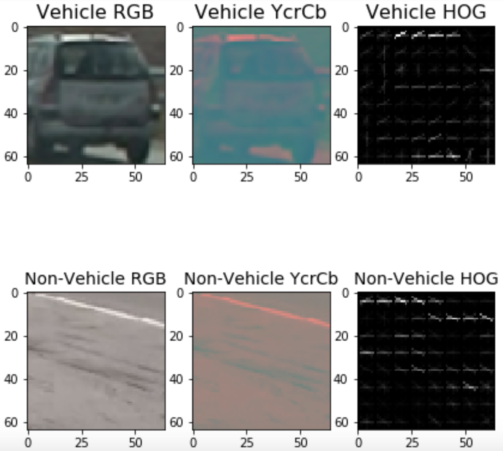


Figure 1. Hog features


#### 
**2. Color space of HOG parameters choice**

In order to settle the final choice for color space and HOG parameters, I tried various combinations of parameters and color space.

I use a linear SVM classifier to help me make the decision, the one which enable the classifier to achieve the highest accuracy on test dataset is chosen.

To note that, the test dataset I use is some screenshot images which I collected manually and resized to 64 by 64 pixels. 

As shown below, the provided dataset is not well representative of real data in the video. We could clearly see that, the svm performs perfectly on whatever color space on the provided set. Its accuracy is consistently close to 100% on the provided dataset. However, there is a great distinction between its performances on different color space over the screenshot dataset.

Given that orientations=8, pixels_per_cell=(8, 8) and cells_per_block=(2, 2), YCrCb stands out. 


<table>
  <tr>
   <td>accuracy
   </td>
   <td>RGB
   </td>
   <td>YUV
   </td>
   <td>YCrCb
   </td>
  </tr>
  <tr>
   <td>Training dataset
   </td>
   <td>0.973
   </td>
   <td>0.989
   </td>
   <td>0.987
   </td>
  </tr>
  <tr>
   <td>Screenshot images test
   </td>
   <td>0.661
   </td>
   <td>0.789
   </td>
   <td>0.792
   </td>
  </tr>
</table>


Table 1

Given that orientations=8 and cells_per_block=(2, 2), I also explored the pix_per_cell parameter on different color space. As shown below, by assigning pix_per_cell to 16, the classifier accuracy is dramatically improved to 86.64% on screenshot dataset.


<table>
  <tr>
   <td>pix_per_cell
   </td>
   <td>RGB
   </td>
   <td>YUV
   </td>
   <td>YCrCb
   </td>
  </tr>
  <tr>
   <td>8
   </td>
   <td>0.661
   </td>
   <td>0.789
   </td>
   <td>0.792
   </td>
  </tr>
  <tr>
   <td>16
   </td>
   <td>0.6399
   </td>
   <td>0.8614
   </td>
   <td>0.8664
   </td>
  </tr>
</table>


Table 2

The final choice for color space and hog parameter is:


<table>
  <tr>
   <td>Parameter
   </td>
   <td>Value
   </td>
  </tr>
  <tr>
   <td>orientations
   </td>
   <td>8
   </td>
  </tr>
  <tr>
   <td>pixels_per_cell
   </td>
   <td>(16, 16)
   </td>
  </tr>
  <tr>
   <td>cells_per_block
   </td>
   <td>(2, 2)
   </td>
  </tr>
  <tr>
   <td>Color space
   </td>
   <td>YCrCb
   </td>
  </tr>
</table>


Table 3


#### 
**3. Classifier training**


```
Code: line 41 - 63 in vehicle_classifier.py
```


**3.1 Data augmentation:**

In order to improve the the classification accuracy on real data. I augmented the training dataset by adding more vehicle examples and non-vehicles examples from the screenshots and internet.

To generate more examples, I use crop_image function (`line 11 - 19 in vehicle_classifier.py`) to crop the top-right, top-left, bottom-right and bottom-left parts of a car image and then resize them all to 64*64 png images.


<p id="gdcalert2" ><span style="color: red; font-weight: bold">>>>>>  gd2md-html alert: inline image link here (to images/P51.png). Store image on your image server and adjust path/filename if necessary. </span><br>(<a href="#">Back to top</a>)(<a href="#gdcalert3">Next alert</a>)<br><span style="color: red; font-weight: bold">>>>>> </span></p>


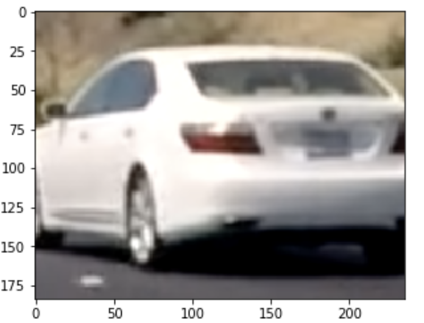


Figure 2. screenshot car image


<table>
  <tr>
   <td>

<p id="gdcalert3" ><span style="color: red; font-weight: bold">>>>>>  gd2md-html alert: inline image link here (to images/P52.png). Store image on your image server and adjust path/filename if necessary. </span><br>(<a href="#">Back to top</a>)(<a href="#gdcalert4">Next alert</a>)<br><span style="color: red; font-weight: bold">>>>>> </span></p>


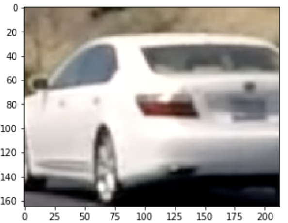

   </td>
   <td>

<p id="gdcalert4" ><span style="color: red; font-weight: bold">>>>>>  gd2md-html alert: inline image link here (to images/P53.png). Store image on your image server and adjust path/filename if necessary. </span><br>(<a href="#">Back to top</a>)(<a href="#gdcalert5">Next alert</a>)<br><span style="color: red; font-weight: bold">>>>>> </span></p>


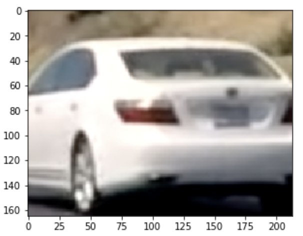

   </td>
  </tr>
  <tr>
   <td>

<p id="gdcalert5" ><span style="color: red; font-weight: bold">>>>>>  gd2md-html alert: inline image link here (to images/P54.png). Store image on your image server and adjust path/filename if necessary. </span><br>(<a href="#">Back to top</a>)(<a href="#gdcalert6">Next alert</a>)<br><span style="color: red; font-weight: bold">>>>>> </span></p>


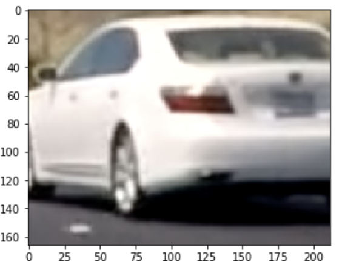

   </td>
   <td>

<p id="gdcalert6" ><span style="color: red; font-weight: bold">>>>>>  gd2md-html alert: inline image link here (to images/P55.png). Store image on your image server and adjust path/filename if necessary. </span><br>(<a href="#">Back to top</a>)(<a href="#gdcalert7">Next alert</a>)<br><span style="color: red; font-weight: bold">>>>>> </span></p>


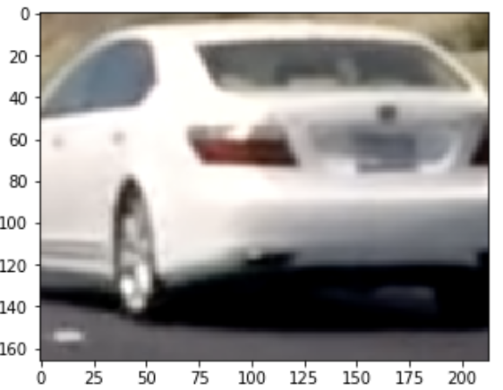

   </td>
  </tr>
</table>


Figure 3. augmented dataset

**3.2 Train and Test classifier:**

The classifier I use is linear SVM, which is fast to train and performs well. I trained the classifier in the following steps:


*   Shuffle augmented dataset
*   Split into training and testing dataset
*   Fit training dataset in linear SVM model and persist to a file (svc_model.sav)
*   Test the classifier on test dataset

In the end, the classifier achieves 98.8% accuracy on test dataset.


### 
**Sliding Window Search**


#### 
**1. Sliding window search. **


```


#### Code : line 8 - 46 in vehicle_detection.py
```


As sliding window search is a very expensive operation, I restrict the sliding window search region to the bottom left part of the image.

As a result of perspective, the cars further away are smaller and those closerby are bigger, it doesn't make sense to slide small windows across the bottom of the image since the cars that appear there are too big to fit into the window. The same reasoning goes for the image area in the middle, big window won't help there as cars are too small to be recognized in a big window.

Five different sized windows are used in my sliding window algorithm. As shown in the image, window sizes varies along with the perspective.


<p id="gdcalert7" ><span style="color: red; font-weight: bold">>>>>>  gd2md-html alert: inline image link here (to images/P56.png). Store image on your image server and adjust path/filename if necessary. </span><br>(<a href="#">Back to top</a>)(<a href="#gdcalert8">Next alert</a>)<br><span style="color: red; font-weight: bold">>>>>> </span></p>


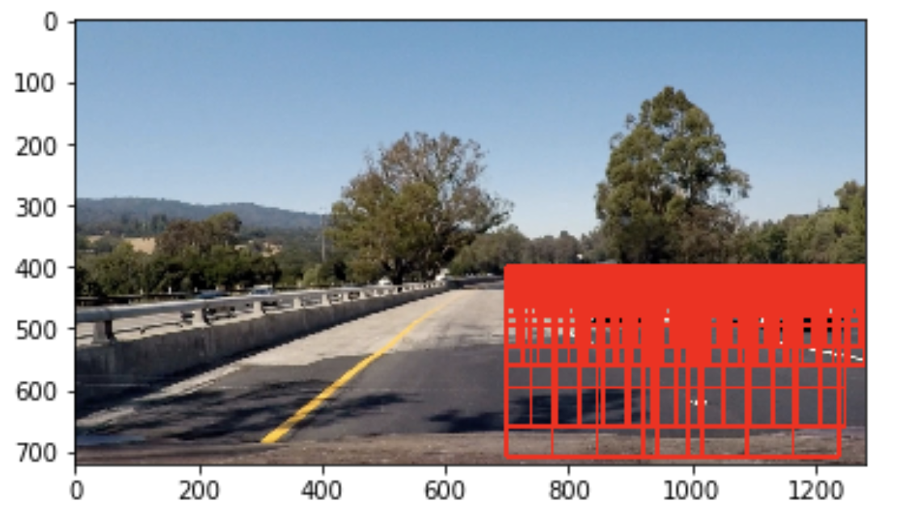


Figure 4. All sliding windows


<table>
  <tr>
   <td>x_start_stop
   </td>
   <td>y_start_stop
   </td>
   <td>window_size
   </td>
   <td>xy_step
   </td>
  </tr>
  <tr>
   <td>(400, 464)
   </td>
   <td>(700, 1280)
   </td>
   <td>(64, 64)
   </td>
   <td>(0.1, 0.1)
   </td>
  </tr>
  <tr>
   <td>(416, 480)
   </td>
   <td>(700, 1280)
   </td>
   <td>(64, 64)
   </td>
   <td>(0.2, 0.2)
   </td>
  </tr>
  <tr>
   <td>(400, 496)
   </td>
   <td>(700, 1280)
   </td>
   <td>(96, 96)
   </td>
   <td>(0.2, 0.2)
   </td>
  </tr>
  <tr>
   <td>(432, 528)
   </td>
   <td>(700, 1280)
   </td>
   <td>(96, 96)
   </td>
   <td>(0.2, 0.2)
   </td>
  </tr>
  <tr>
   <td>(400, 528)
   </td>
   <td>(700, 1280)
   </td>
   <td>(128, 128)
   </td>
   <td>(0.2, 0.2)
   </td>
  </tr>
  <tr>
   <td>(432, 560)
   </td>
   <td>(700, 1280)
   </td>
   <td>(128, 128)
   </td>
   <td>(0.2, 0.2)
   </td>
  </tr>
  <tr>
   <td>(400, 596)
   </td>
   <td>(700, 1280)
   </td>
   <td>(196, 196)
   </td>
   <td>(0.2, 0.2)
   </td>
  </tr>
  <tr>
   <td>(400, 596)
   </td>
   <td>(700, 1280)
   </td>
   <td>(196, 196)
   </td>
   <td>(0.2, 0.2)
   </td>
  </tr>
  <tr>
   <td>(464, 660)
   </td>
   <td>(700, 1280)
   </td>
   <td>(196, 196)
   </td>
   <td>(0.2, 0.2)
   </td>
  </tr>
  <tr>
   <td>(464, 720)
   </td>
   <td>(700, 1280)
   </td>
   <td>(244, 244)
   </td>
   <td>(0.3, 0.3)
   </td>
  </tr>
  <tr>
   <td>(464, 720)
   </td>
   <td>(700, 1280)
   </td>
   <td>(244, 244)
   </td>
   <td>(0.3, 0.3)
   </td>
  </tr>
</table>


 Table 4. sliding window region


#### 
**2. Pipeline**


```


#### Code : line 54 - 141 in vehicle_detection.py
```


Ultimately I used YCrCb 3-channel HOG features as feature vector, which provided a nice result. The pipeline is:


*   Detect cars with sliding window
*   Locate heat areas with heatmap 
*   Fit heat areas with bounding box

Here are some example images:


<p id="gdcalert8" ><span style="color: red; font-weight: bold">>>>>>  gd2md-html alert: inline image link here (to images/P57.png). Store image on your image server and adjust path/filename if necessary. </span><br>(<a href="#">Back to top</a>)(<a href="#gdcalert9">Next alert</a>)<br><span style="color: red; font-weight: bold">>>>>> </span></p>


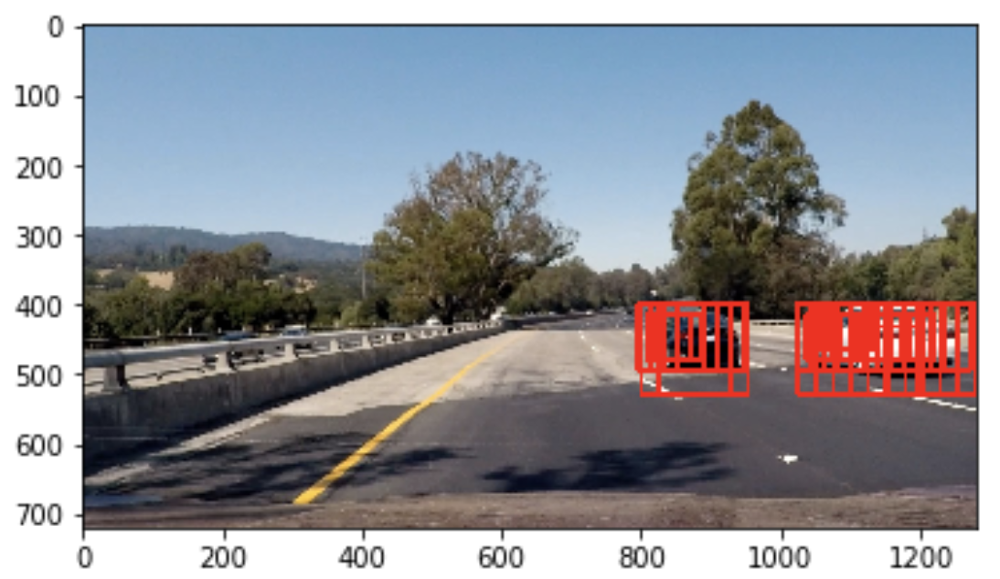


Figure 5. Active sliding windows


<p id="gdcalert9" ><span style="color: red; font-weight: bold">>>>>>  gd2md-html alert: inline image link here (to images/P58.png). Store image on your image server and adjust path/filename if necessary. </span><br>(<a href="#">Back to top</a>)(<a href="#gdcalert10">Next alert</a>)<br><span style="color: red; font-weight: bold">>>>>> </span></p>


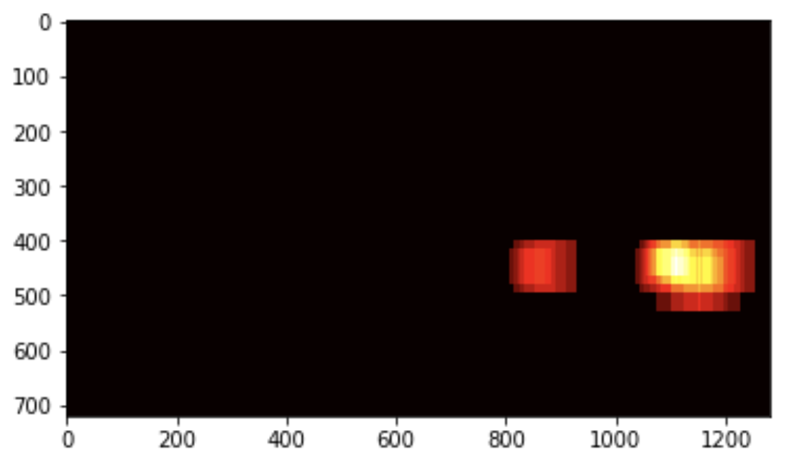


Figure 6.  Corresponding heatmap


<p id="gdcalert10" ><span style="color: red; font-weight: bold">>>>>>  gd2md-html alert: inline image link here (to images/P59.png). Store image on your image server and adjust path/filename if necessary. </span><br>(<a href="#">Back to top</a>)(<a href="#gdcalert11">Next alert</a>)<br><span style="color: red; font-weight: bold">>>>>> </span></p>


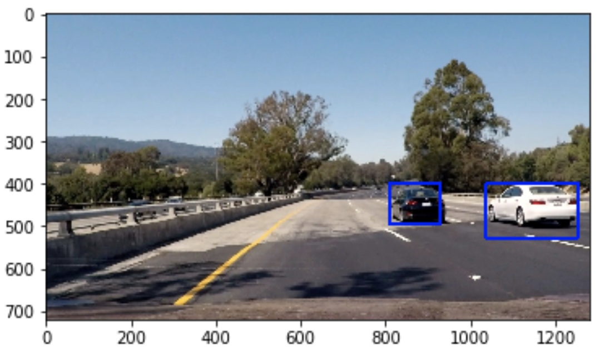


Figure 7. Resulting bounding box


<table>
  <tr>
   <td>
   </td>
   <td>Sliding window
   </td>
   <td>Heatmap
   </td>
   <td>Bounding box
   </td>
  </tr>
  <tr>
   <td>Test 1
   </td>
   <td>

<p id="gdcalert11" ><span style="color: red; font-weight: bold">>>>>>  gd2md-html alert: inline image link here (to images/P510.png). Store image on your image server and adjust path/filename if necessary. </span><br>(<a href="#">Back to top</a>)(<a href="#gdcalert12">Next alert</a>)<br><span style="color: red; font-weight: bold">>>>>> </span></p>


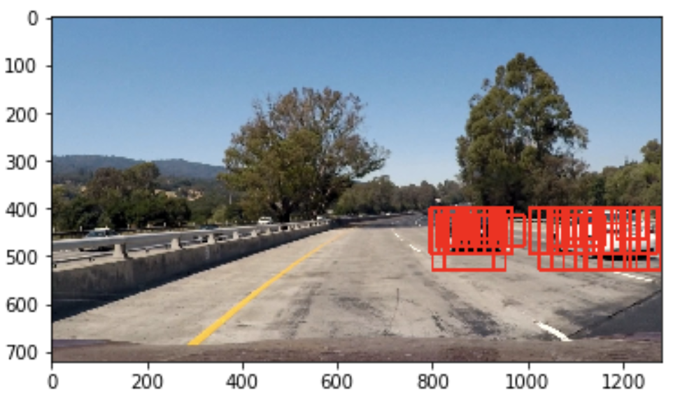

   </td>
   <td>

<p id="gdcalert12" ><span style="color: red; font-weight: bold">>>>>>  gd2md-html alert: inline image link here (to images/P511.png). Store image on your image server and adjust path/filename if necessary. </span><br>(<a href="#">Back to top</a>)(<a href="#gdcalert13">Next alert</a>)<br><span style="color: red; font-weight: bold">>>>>> </span></p>


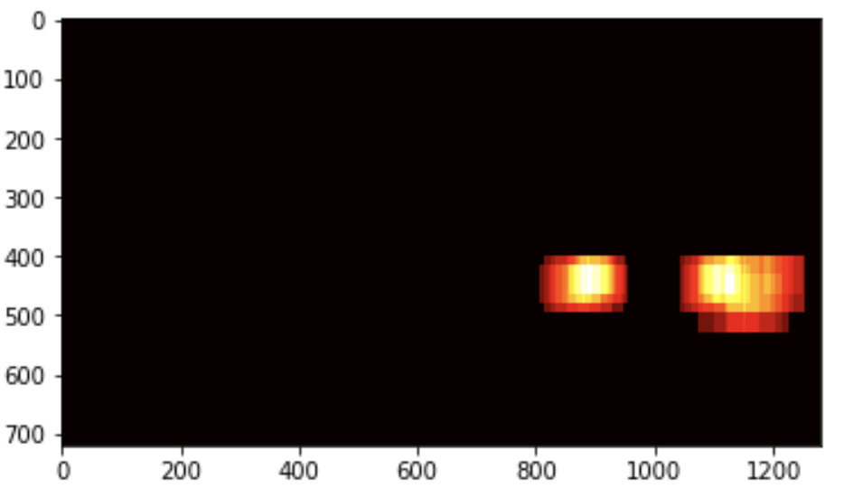

   </td>
   <td>

<p id="gdcalert13" ><span style="color: red; font-weight: bold">>>>>>  gd2md-html alert: inline image link here (to images/P512.png). Store image on your image server and adjust path/filename if necessary. </span><br>(<a href="#">Back to top</a>)(<a href="#gdcalert14">Next alert</a>)<br><span style="color: red; font-weight: bold">>>>>> </span></p>


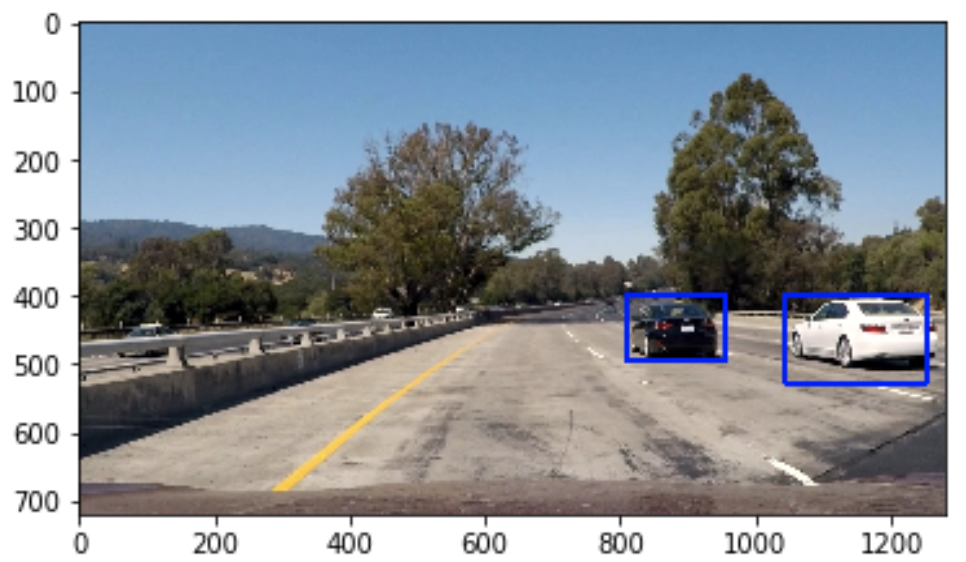

   </td>
  </tr>
  <tr>
   <td>Test 2
   </td>
   <td>

<p id="gdcalert14" ><span style="color: red; font-weight: bold">>>>>>  gd2md-html alert: inline image link here (to images/P513.png). Store image on your image server and adjust path/filename if necessary. </span><br>(<a href="#">Back to top</a>)(<a href="#gdcalert15">Next alert</a>)<br><span style="color: red; font-weight: bold">>>>>> </span></p>


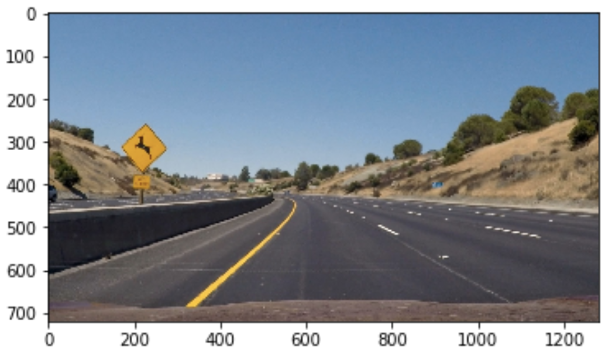

   </td>
   <td>

<p id="gdcalert15" ><span style="color: red; font-weight: bold">>>>>>  gd2md-html alert: inline image link here (to images/P514.png). Store image on your image server and adjust path/filename if necessary. </span><br>(<a href="#">Back to top</a>)(<a href="#gdcalert16">Next alert</a>)<br><span style="color: red; font-weight: bold">>>>>> </span></p>


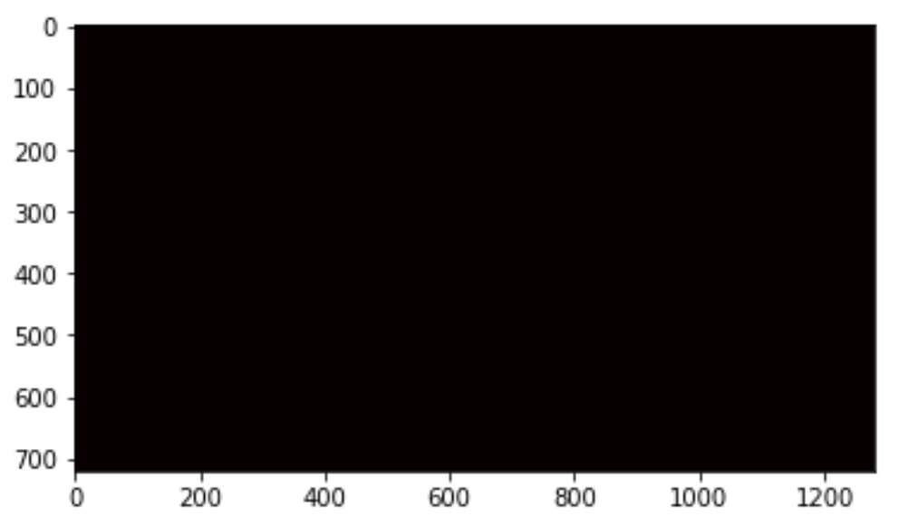

   </td>
   <td>

<p id="gdcalert16" ><span style="color: red; font-weight: bold">>>>>>  gd2md-html alert: inline image link here (to images/P515.png). Store image on your image server and adjust path/filename if necessary. </span><br>(<a href="#">Back to top</a>)(<a href="#gdcalert17">Next alert</a>)<br><span style="color: red; font-weight: bold">>>>>> </span></p>


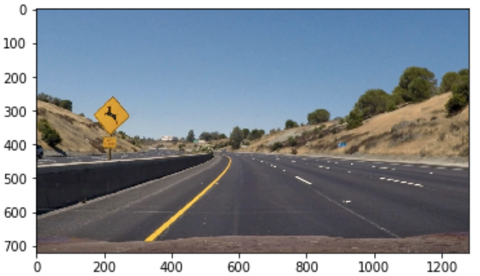

   </td>
  </tr>
  <tr>
   <td>Test 3
   </td>
   <td>

<p id="gdcalert17" ><span style="color: red; font-weight: bold">>>>>>  gd2md-html alert: inline image link here (to images/P516.png). Store image on your image server and adjust path/filename if necessary. </span><br>(<a href="#">Back to top</a>)(<a href="#gdcalert18">Next alert</a>)<br><span style="color: red; font-weight: bold">>>>>> </span></p>


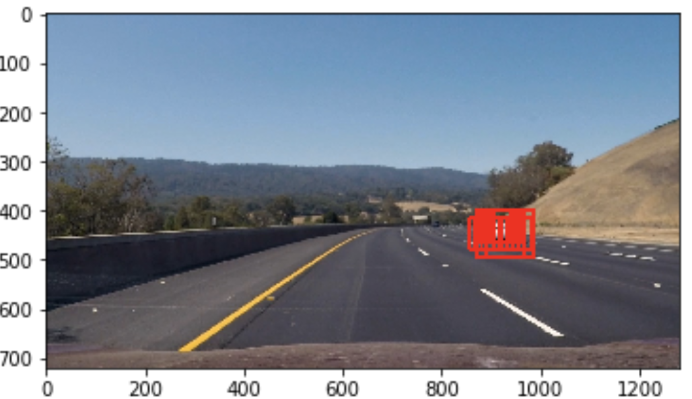

   </td>
   <td>

<p id="gdcalert18" ><span style="color: red; font-weight: bold">>>>>>  gd2md-html alert: inline image link here (to images/P517.png). Store image on your image server and adjust path/filename if necessary. </span><br>(<a href="#">Back to top</a>)(<a href="#gdcalert19">Next alert</a>)<br><span style="color: red; font-weight: bold">>>>>> </span></p>


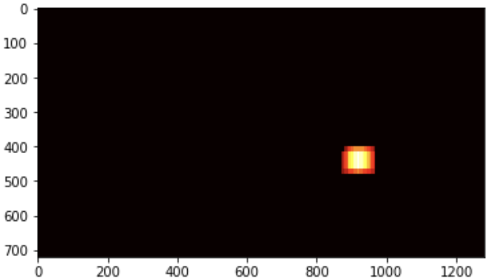

   </td>
   <td>

<p id="gdcalert19" ><span style="color: red; font-weight: bold">>>>>>  gd2md-html alert: inline image link here (to images/P518.png). Store image on your image server and adjust path/filename if necessary. </span><br>(<a href="#">Back to top</a>)(<a href="#gdcalert20">Next alert</a>)<br><span style="color: red; font-weight: bold">>>>>> </span></p>


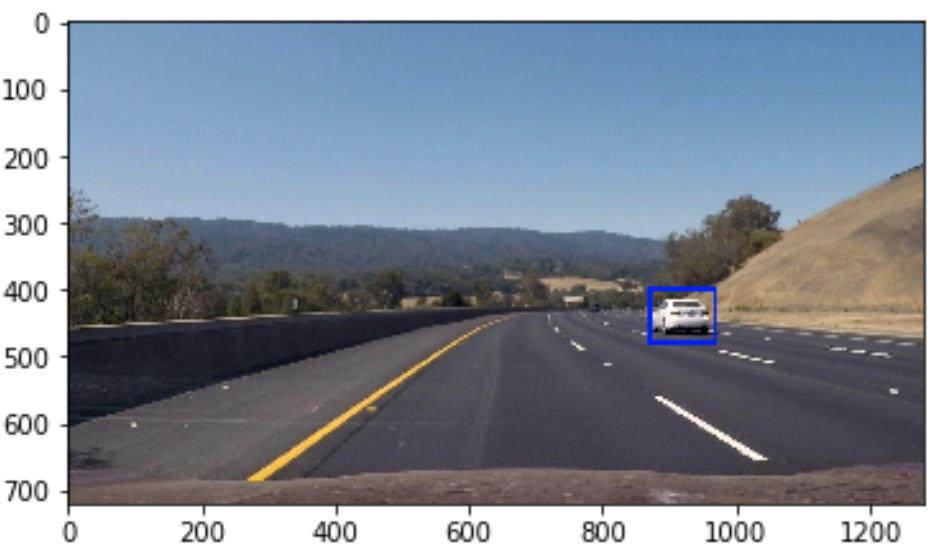

   </td>
  </tr>
  <tr>
   <td>Test 4
   </td>
   <td>

<p id="gdcalert20" ><span style="color: red; font-weight: bold">>>>>>  gd2md-html alert: inline image link here (to images/P519.png). Store image on your image server and adjust path/filename if necessary. </span><br>(<a href="#">Back to top</a>)(<a href="#gdcalert21">Next alert</a>)<br><span style="color: red; font-weight: bold">>>>>> </span></p>


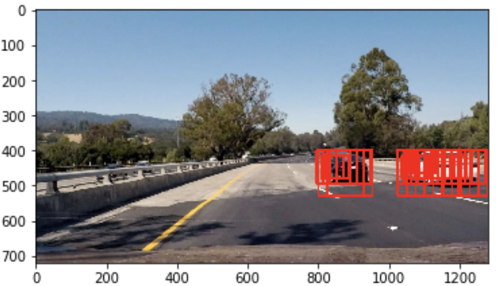

   </td>
   <td>

<p id="gdcalert21" ><span style="color: red; font-weight: bold">>>>>>  gd2md-html alert: inline image link here (to images/P520.png). Store image on your image server and adjust path/filename if necessary. </span><br>(<a href="#">Back to top</a>)(<a href="#gdcalert22">Next alert</a>)<br><span style="color: red; font-weight: bold">>>>>> </span></p>


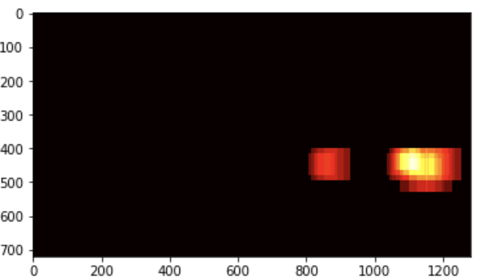

   </td>
   <td>

<p id="gdcalert22" ><span style="color: red; font-weight: bold">>>>>>  gd2md-html alert: inline image link here (to images/P521.png). Store image on your image server and adjust path/filename if necessary. </span><br>(<a href="#">Back to top</a>)(<a href="#gdcalert23">Next alert</a>)<br><span style="color: red; font-weight: bold">>>>>> </span></p>


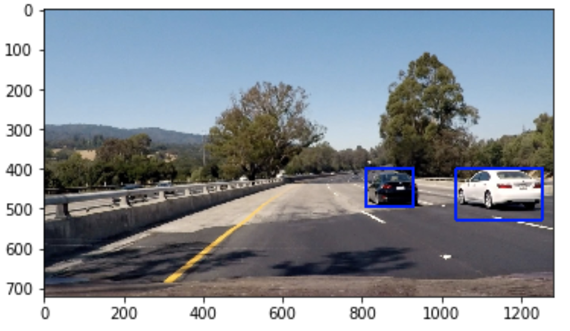

   </td>
  </tr>
  <tr>
   <td>Test 5
   </td>
   <td>

<p id="gdcalert23" ><span style="color: red; font-weight: bold">>>>>>  gd2md-html alert: inline image link here (to images/P522.png). Store image on your image server and adjust path/filename if necessary. </span><br>(<a href="#">Back to top</a>)(<a href="#gdcalert24">Next alert</a>)<br><span style="color: red; font-weight: bold">>>>>> </span></p>


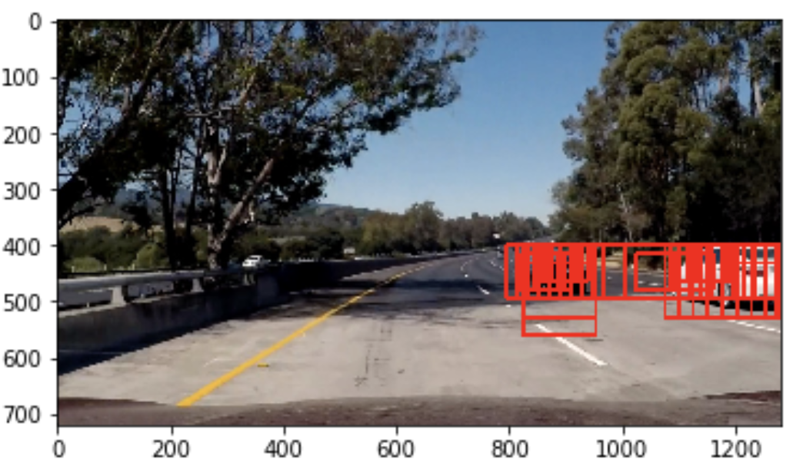

   </td>
   <td>

<p id="gdcalert24" ><span style="color: red; font-weight: bold">>>>>>  gd2md-html alert: inline image link here (to images/P523.png). Store image on your image server and adjust path/filename if necessary. </span><br>(<a href="#">Back to top</a>)(<a href="#gdcalert25">Next alert</a>)<br><span style="color: red; font-weight: bold">>>>>> </span></p>


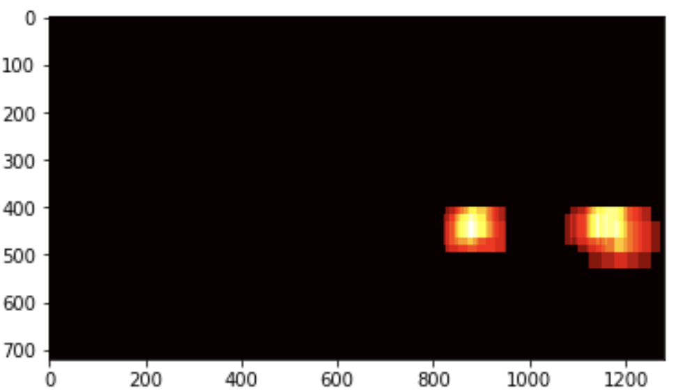

   </td>
   <td>

<p id="gdcalert25" ><span style="color: red; font-weight: bold">>>>>>  gd2md-html alert: inline image link here (to images/P524.png). Store image on your image server and adjust path/filename if necessary. </span><br>(<a href="#">Back to top</a>)(<a href="#gdcalert26">Next alert</a>)<br><span style="color: red; font-weight: bold">>>>>> </span></p>


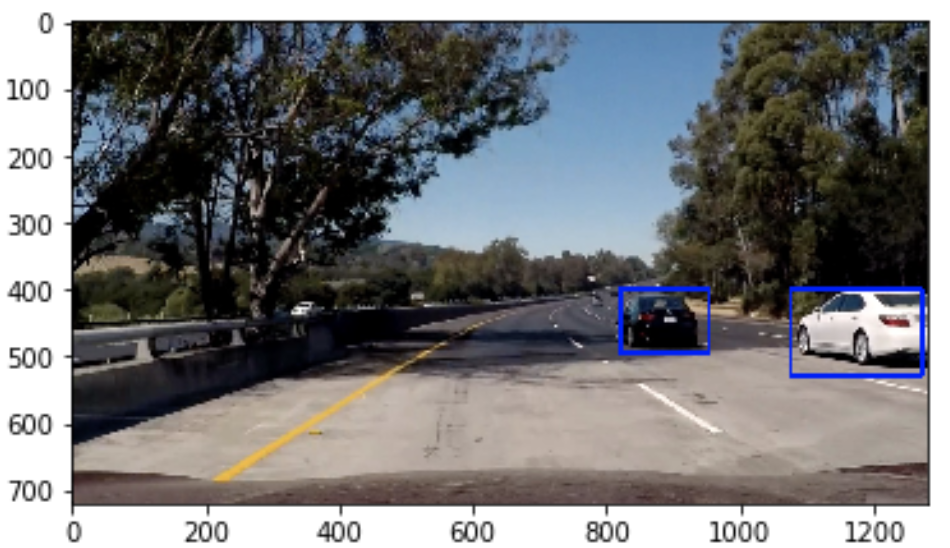

   </td>
  </tr>
  <tr>
   <td>Test 6
   </td>
   <td>

<p id="gdcalert26" ><span style="color: red; font-weight: bold">>>>>>  gd2md-html alert: inline image link here (to images/P525.png). Store image on your image server and adjust path/filename if necessary. </span><br>(<a href="#">Back to top</a>)(<a href="#gdcalert27">Next alert</a>)<br><span style="color: red; font-weight: bold">>>>>> </span></p>


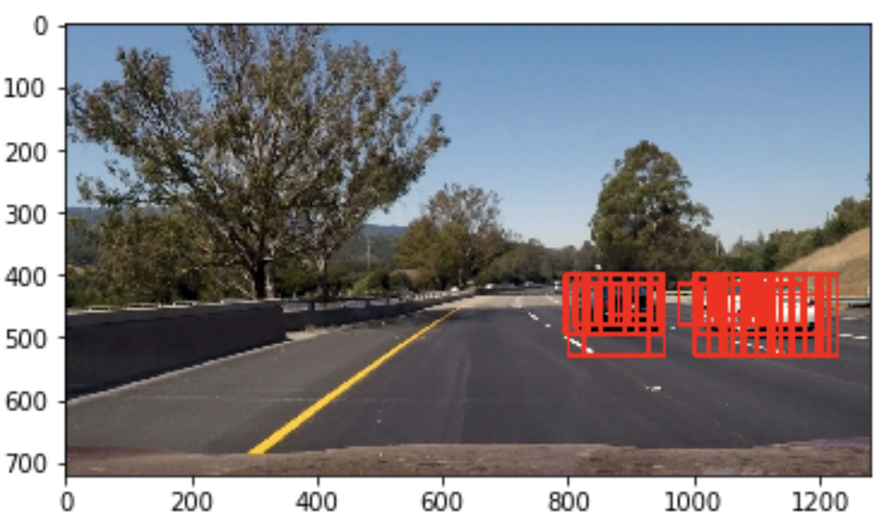

   </td>
   <td>

<p id="gdcalert27" ><span style="color: red; font-weight: bold">>>>>>  gd2md-html alert: inline image link here (to images/P526.png). Store image on your image server and adjust path/filename if necessary. </span><br>(<a href="#">Back to top</a>)(<a href="#gdcalert28">Next alert</a>)<br><span style="color: red; font-weight: bold">>>>>> </span></p>


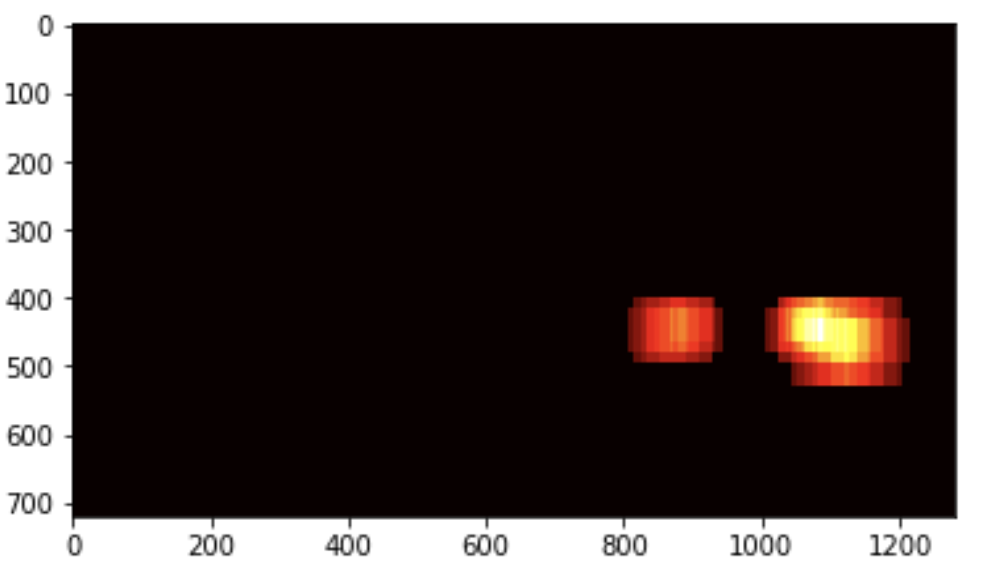

   </td>
   <td>

<p id="gdcalert28" ><span style="color: red; font-weight: bold">>>>>>  gd2md-html alert: inline image link here (to images/P527.png). Store image on your image server and adjust path/filename if necessary. </span><br>(<a href="#">Back to top</a>)(<a href="#gdcalert29">Next alert</a>)<br><span style="color: red; font-weight: bold">>>>>> </span></p>


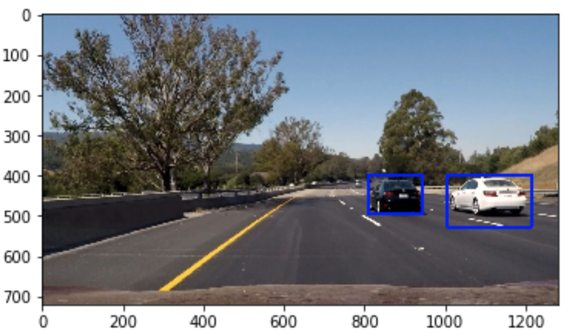

   </td>
  </tr>
</table>


Table 8. Six frames pipeline example


### 
**Video Implementation**


#### 
**1. Final video output. **

My pipeline turns out to perform reasonably well on the entire project video, although there are somewhat wobbly or unstable bounding boxes, the vehicles are well identified most of the time with no false positives.

Here's the link to my video:  [https://youtu.be/jKj8i51It5g](https://youtu.be/jKj8i51It5g)


#### 
**2. False positive and overlapping bounding box filtering**


```


####    Code : line 106 - 110 in vehicle_detection.py
```


The idea is very intuitive, cars are not likely to be tall and thin like a pin. It's often the case that such thin and tall windows are the overlapping area of two close cars.

The windows with very small height or width, or with large ratio of height over width are filtered out.


#### 
**3. Bounding box stabilization**


```


####   Code : line 113 - 123 in vehicle_detection.py
```


My bounding box stabilization technique doesn't work out well. :(

My idea is simple, average the box size with the last frame:


*   Calculate the center point of the car. (`Code : line 65 - 74 in vehicle_detection.py)`
*   Find the box of the same car in the last frame (the one with largest overlapping area with current bounding box). (`Code : line 77 - 92 in vehicle_detection.py)`
*   Average current box with the one in the last frame (`Code : line 115 - 122 in vehicle_detection.py)`

Below is an illustration of how this algorithm works:

Given boxes_in_last_frame = [], the output is like the following figure:


<p id="gdcalert29" ><span style="color: red; font-weight: bold">>>>>>  gd2md-html alert: inline image link here (to images/P528.png). Store image on your image server and adjust path/filename if necessary. </span><br>(<a href="#">Back to top</a>)(<a href="#gdcalert30">Next alert</a>)<br><span style="color: red; font-weight: bold">>>>>> </span></p>


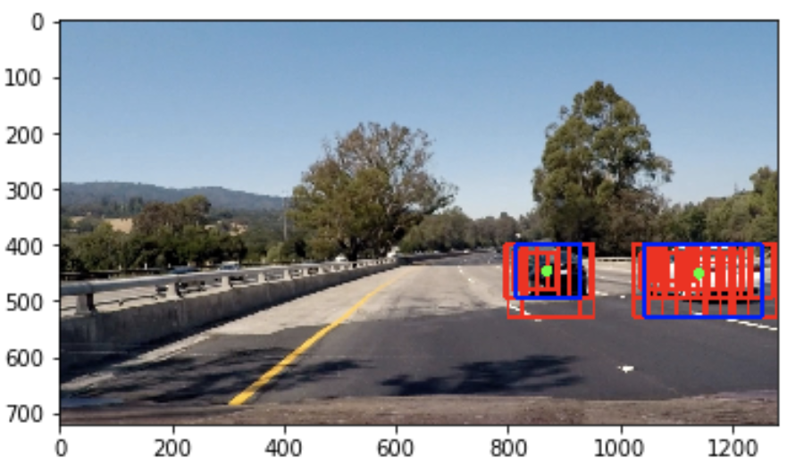


Figure 8. Bounding box with no averaging

Given boxes_in_last_frame  = [(1042, 400, 210, 90), (814, 400, 160, 96)], 

the bounding boxes are averaged with the ones in the last frame.


<p id="gdcalert30" ><span style="color: red; font-weight: bold">>>>>>  gd2md-html alert: inline image link here (to images/P529.png). Store image on your image server and adjust path/filename if necessary. </span><br>(<a href="#">Back to top</a>)(<a href="#gdcalert31">Next alert</a>)<br><span style="color: red; font-weight: bold">>>>>> </span></p>


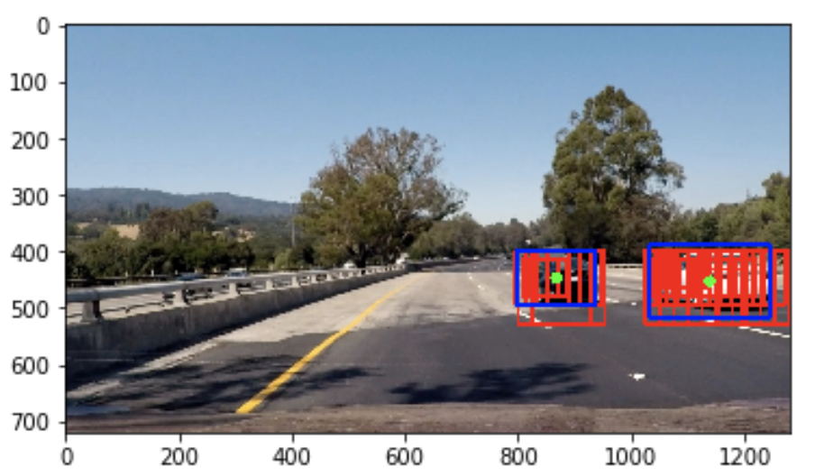


Figure 9. Bounding box with averaging


### 
**Discussion**


#### 
**1. Briefly discuss any problems / issues you faced in your implementation of this project. Where will your pipeline likely fail? What could you do to make it more robust?**

Problem 1: sliding window approach is too slow.

It took my mac pro 20 mins to process the 50-seconds project video. Real autonomous driving car won't work out with my implementation.

Problem 2: too many hand-tuned parameters.

The hog feature parameters and sliding window algorithm are too hand-crafted and specially tuned for the project video only, which may not generalize well to other scenarios.

Problem 3: classifier leverages only HOG features.

If I were given more samples, I would include more features to feature vectors. The reason for which I didn't do so is that I fear the curse of high dimensionality if I use too my features with only less than 9000 samples provided.

